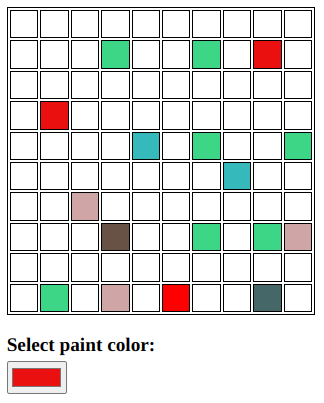

# Autonomous Canvas

Built with [MUD2](https://mud.dev/)

This is a simple prototype to try MUD2. 

It's a shared canvas, where each user can paint a pixel and the color of that pixel affects the color of its neighbors. 

The CanvasSystem is responsible to paint the pixels, saving the data on a MUD2 table  (https://github.com/damianmarti/mud2canvas/blob/master/packages/contracts/src/systems/CanvasSystem.sol).

And then this canvas is shown in the frontend using the useRows hooks, to query the MUD2 table (https://github.com/damianmarti/mud2canvas/blob/master/packages/client/src/App.tsx).
